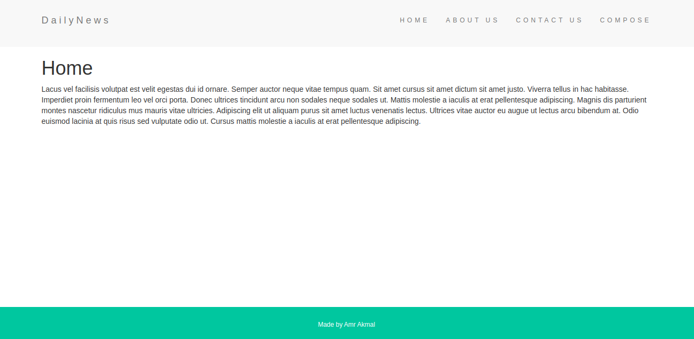
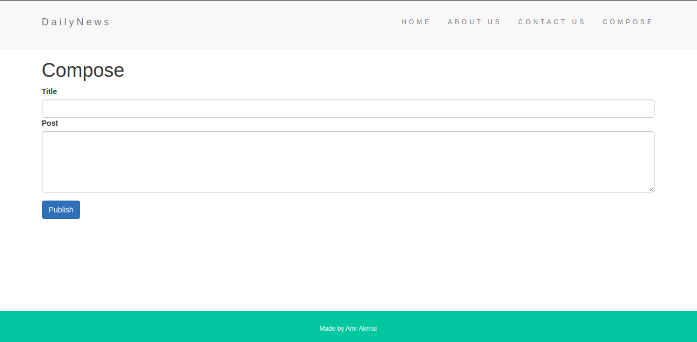
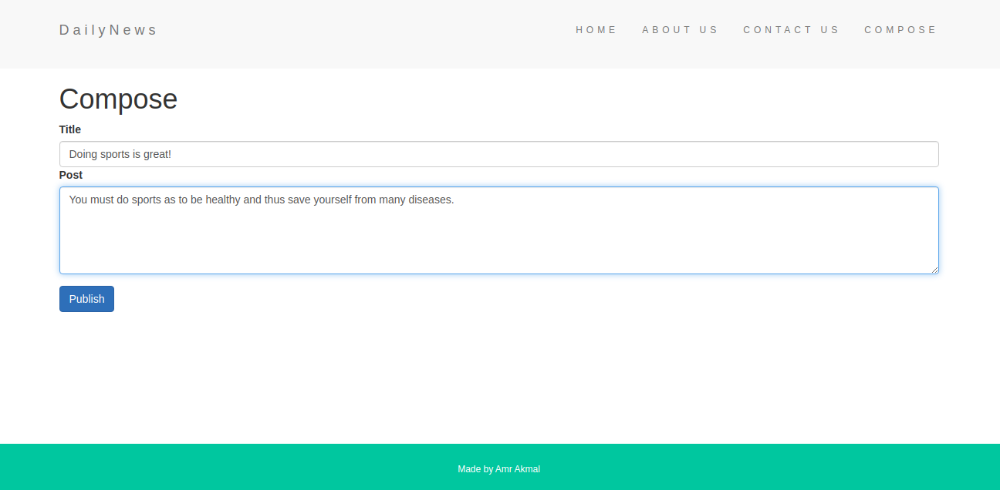
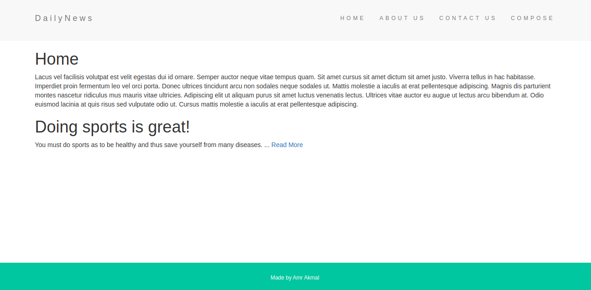

# DailyBlogs
 A web application where users can post their blogs/posts.
 Dynamic search for any post using the post title.  
 **Live** at: https://fast-tundra-23615.herokuapp.com/ 

# Technologies Used
* Node.js
* Express.js
* MongoDB(Mongoose)
* EJS
* JavaScript

 # What I learnt
 * How to use parameters passed to the routes.
 * Dynamic search using a certain key (Case insensitive).
 * Using MongoDB(mongoose) fro saving posts and rendering them as specified.
 * **Loadash** for manipulating strings.
 
 # Some pictures
 **Home Page**   
 
     
**Writing a new Post/Blog**    
   
 
   
 **Rendering new composed posts to the home page**    
 
    
